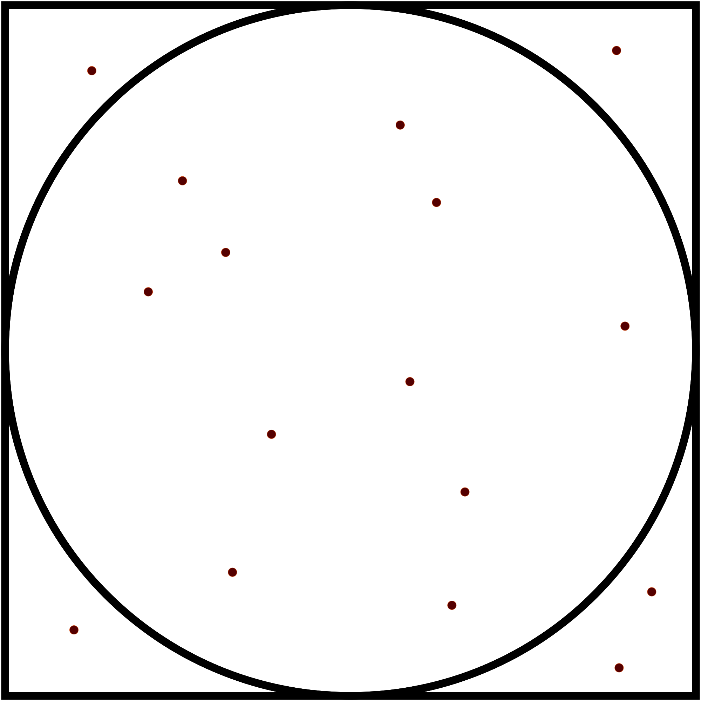

# Estimating $\pi$ stochastically

Imagine you have a circle of radius inscribed into a square. The radius of the circle is equal half the length of the square. Now imagine we pick a random point on this figure, that is, we select two random numbers ($x$, $y$) and place a dot at the coordinate. What is the probability that the random point is within the circle?

$P = \frac{A_\text{circle}}{A_\text{square}} = \frac{\pi}{4}$

<p align="center">

</p>

This means that we can estimate the value of $\pi$ by computing this probability. How would we do this? We can run a virtual experiment!

# Programming languages

For this project, I will write instructions for three programming languagues:

1. C
> C is one of the most influential programming languages. It is old, but it remains important as it is considered a very efficient tool often yielding the best runtime performance. C is a [compiled language](https://www.geeksforgeeks.org/difference-between-compiled-and-interpreted-language/) and [statically typed](https://www.geeksforgeeks.org/what-is-a-typed-language/). 
2. Python
> Python is one the most popular programming languages across different fields of applications. In science, it became mainstream since it is very convenient for prototyping numerical methods and data analysis. Python is an [interpreted language](https://www.geeksforgeeks.org/difference-between-compiled-and-interpreted-language/) and [dynamically typed](https://www.geeksforgeeks.org/what-is-a-typed-language/).
3. Julia
> Julia is a fairly new programming language that has been increasing popular in scientific computing. It uses a *just-in-time* compilation scheme providing the dynamic experience without sacrificing too much performance. 

## General Instruction

## C Instructions

Your C code must be wrapped within a main function. For example, let us look at a simple hello world code
```
#include <stdio.h>

int main() {
    printf("Hello World\n");
    return 0;
}
```
Remember the following:
1. You need to declare variable types and the return type of your functions (e.g. `int` for `main`). 
2. Semicolons (`;`) must be added at the end of every command.
3. Curly braces must wrap functions, loops, and if statements.

Once you are done writing your code you will need to compile it. In the terminal run
```
gcc -Wall mycode.c -o mycode -lm
```
where `mycode` is the name of your file. The file must end with `.c`. If the compilation is successful, a compiled version of your code (`mycode`) is created. Now you can run it as
```
./mycode
```