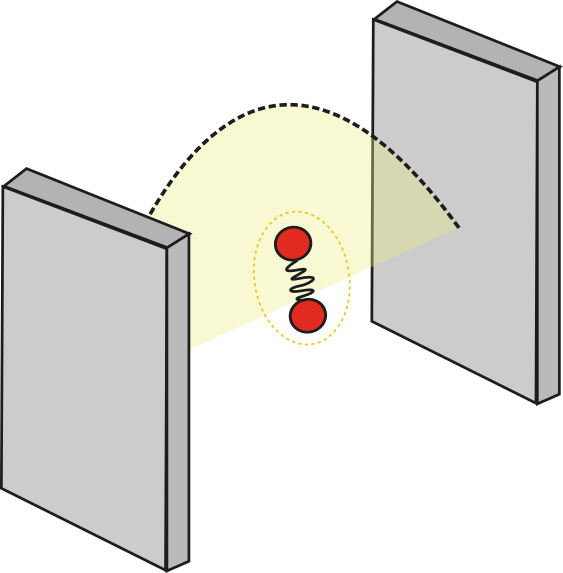

# Tavis-Cummings model for strong light-matter interactions

Consider a system where the interaction between light and matter becomes significantly strong. One way to achieve the strong coupling regime is confining the electromagnetic field in a small space. This can be understood looking at the light-matter interaction component of the Hamiltonian where the electromagnetic field has been quantized

$$\Large \hat{H}_{LM} \leftarrow \sqrt{\frac{\hbar \omega}{2\epsilon_0 V}} \mu_M$$ 

The intensity of the interaction between a radiation field with frequency $\omega$ and a molecule with transition dipole moment magnitude of $\mu_M$ increases as the quantization volume $V$ is decreased. Experimentally, this condition has been achieved within microcavities, where light is trapped between two high-quality mirror allowing it to interact strong with molecules inside it. Moreover, the length of the cavity (distance between the two mirrors) dictates which radiation modes can be supported inside it.

In this tutorial, we will build an idealized Hamiltonian that can be used to model the energetics and dynamics of systems where the coupling of light and matter becomes strong. 

## Quantum formalism for matter

At this point, we are used to quantum states of matter. For example, if we have a two-level system representing our atom and molecule $|g \rangle$ and $|e \rangle$, the time-independent Schrödinger gives us the energy of each state

$$\Large \hat{H}_M |g\rangle = E_g |g \rangle = \hbar \omega_g |g \rangle \normalsize \qquad \text{(1a)}$$ 
$$\Large \hat{H}_M |e\rangle = E_e |e \rangle = \hbar \omega_e |e \rangle \normalsize \qquad \text{(1b)}$$ 

Given that we know the eigenstates of our molecular system and we are assuming it forms a complete basis (i.e. any arbitrary molecular state can be written as a combination of $|g\rangle$ and $|e\rangle$) we can express our Hamiltonian in this basis. Recall that the identity operator can be expressed as the resolution of the identity

$$\Large 1\!\!1 = \sum_k |k\rangle \langle k | $$

where $k$ are the basis that form the complete Hilbert space we are interested. In our case, the molecular basis contains only two basis. Thus,

$$\Large \hat{H}_M =  1\!\!1 \hat{H}_M  1\!\!1 = (|g\rangle \langle g | + |e\rangle \langle e | ) \hat{H}_M  (|g\rangle \langle g | + |e\rangle \langle e | ) $$

Using equation 1 and the fact the $|g\rangle$ and $|e\rangle$ are orthonormal, we get

$$\Large \hat{H}_M = \hbar \omega_g |g\rangle \langle g |+ \hbar\omega_e |e\rangle \langle e | $$

For our purposes, only the energy difference between the states is important, thus we can choose the set the energy of the ground state to zero yielding the very simple Hamiltonian:

$$\Large \hat{H}_M = \hbar\omega_M |e\rangle \langle e | $$

where we switched the subscript to $M$ to indicate that this energy correspond to the excitation energy of the system. Note that, this form of the Hamiltonian bypass the need of defining complicated molecular details, but it requires the *a priori* knowledge of the energy levels of the system. 

We can also define ladder operators in this basis

$$\Large \sigma^+ = |e\rangle \langle g |$$
$$\Large \sigma^- = |g\rangle \langle e |$$
such that

$$\Large \sigma^+ |g \rangle = |e\rangle \qquad \sigma^+ |e \rangle = 0$$
$$\Large \sigma^- |g \rangle = 0 \qquad \sigma^- |e \rangle = |g \rangle$$
Therefore, an alternative Hamiltonian could also be written as 
$$\Large \hat{H}_M = \hbar\omega_M \sigma^+ \sigma^- $$

For a system of $N$ non-interacting molecules, this formalism extends itself easily since the total Hamiltonian is just a sum of individual molecules components

$$\Large \hat{H}_M = \sum_i \hbar \omega_i \sigma^+_i \sigma^-_i $$

## Quantum formalism for light

Upon quantization, the Hamiltonian for electromagnetic field resembles that of a Harmonic oscillator

$$\Large \hat{H}_L = \sum_k \hbar \omega_k a_k^\dagger a_k$$

where the divergent zero-point energy component has been conveniently removed as it does not play a role in the problem we are interested and $a_k$ and $a^\dagger$ represent annihilation and creation operators for Bosons, respectively. 

The eigenstates of the Hamiltonian above are the Fock states represented generically as

$$\Large |n_1 n_2 n_3 ... n_k \rangle $$

where each $n_i$ represents the number of photons in the $i$-th radiation mode. The action of the second quantized operators onto this state is

$$ a_i |n_1 n_2\;...\; n_i \;...\; n_k \rangle = \sqrt{n_k} |n_1 n_2 \;...\; (n_i-1) \;...\; n_k \rangle $$
$$ a_i^\dagger |n_1 n_2\;...\; n_i \;...\; n_k \rangle = \sqrt{n_k+1} |n_1 n_2 \;...\; (n_i+1) \;...\; n_k \rangle $$

Note that, the annihilation operator will destroy the system (return zero) if no photons occupy mode being operated. However, unlike the case for Fermions, the creation operator will not destroy the system regardless of the population of the mode.

> Nonetheless, the creation operation may still destroy the state when operating on the left, in which case it is really acting as an annihilation operator.

The number operator $\hat{N} = a_i^\dagger a_i$ is an useful shortcut that probes the population of a given mode

$$\Large \hat{N}_i|n_1 n_2\;...\; n_i \;...\; n_k \rangle= a_i^\dagger a_i |n_1 n_2\;...\; n_i \;...\; n_k \rangle$$
$$= \Large a_i^\dagger \sqrt{n_i} |n_1 n_2\;...\; (n_i-1) \;...\; n_k \rangle$$
$$= \Large \sqrt{n_i-1+1}\sqrt{n_i} |n_1 n_2\;...\; (n_i-1+1) \;...\; n_k \rangle$$
$$= \Large n_i |n_1 n_2\;...\; n_i \;...\; n_k \rangle$$
