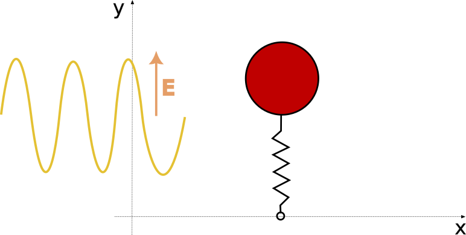

# Classical Harmonic Oscillator interacting with light (fixed periodic field)

In this project we will study the motion and energetics of a classical harmonic oscillator perturbed by an oscillating electric field. Assuming that the mechanical oscillator displacement from equilibrium represents a dipolar motion (e.g., the displacement could correspond to a normal-mode vibration of a heteronuclear diatomic molecule or the motion of an effective "electronic cloud" near a nucleus with charge of equal magnitude as the cloud in which case the model below would represent the interaction of an atom with light), the interaction with the electric field creates an oscillating force. The main goal here is to determine how efficient this interaction is as a function of the detuning (i.e. the difference between the frequency of the mechanical and the electrical oscillators: $\delta = \omega_\text{HO} - \omega_E$). Throughout this project, we will use arbitrary units where the speed of light, mass and charge of the oscillator are set to $1$.

## Model

The coordinate system of the problem is illustrated in the figure below

The mechanical oscillator is constrained to move harmonically along the $y$ direction. Its rest position is set at the origin $(x = 0$, $y = 0)$. Before the electric field is turned on, the equation of motion for the system is the well-known harmonic oscillator differential equation (Newton's 2nd law for motion of a point particle near equilibrium)

$\Large m \frac{\partial^2 y}{\partial t^2} = - k y = - m \omega^2 y$ 

Once the electric field is turned on, we need to account for the electric force acting upon the charged mass (dipole).

$\Large F =  \frac{1}{m}\frac{\partial^2 y}{\partial t^2} = -  \omega^2 y + \frac{q}{m}E(t)$ 

Taking $\frac{q}{m} = 1$ and assuming a simple sinusoidal electrical wave, we have

$\Large F = -\omega^2 y + E_0 \sin(\omega_E t)$ 

Next, we define the a detuning parameter $\delta$ as

$\Large \delta \equiv \frac{\omega_E}{\omega}$

such that

$\Large F = -\omega^2 y + E_0 \sin(\delta \omega t)$ 

## Numerical Method

In order to numerically integrate the model above, we will need to discretize the problem in time steps such that a snapshot of the system can be computed from a previous one after a fixed time interval. To that end, we will employ the Verlet algorithm described [here](bib.md).

The general expansion of a function $f$ in power series around $a$ is

$\Large f(x) = f(a) + f'(a)(x-a) + \frac{1}{2}f''(a)(x-a)^2 + \frac{1}{6}f'''(a)(x-a)^3 + \mathcal{O}[(x-a)^4] \qquad$    (1)

From this equation, we can see that information about the function at some region $x$ can be obtained using information of the function at some point $a$. Using a Taylor series expansion will allow us to determine the position of the particle at some time step  $(t_{n+1} = x)$ using only information of the previous time step $t_n = a$. Substituting these definition into the Taylor series (and replacing $f$ with $y$), we get

$\Large y(t_{n+1}) = y(t_n) + \dot{y}(t_n)(t_{n+1}-t_n) + \frac{1}{2}\ddot{y}(t_n)(t_{n+1}-t_n)^2 + \frac{1}{6}\dot{}\ddot{y}(t_n)(t_{n+1}-t_n)^3 + \mathcal{O}[(t_{n+1}-t_n)^4] $

where we used the dot notation for time detivatives. Defining the time step $\Delta t = t_n-t_{n-1}$, the expression is simplified to

$\Large y(t_{n+1}) = y(t_n) + \dot{y}(t_n)\Delta t + \frac{1}{2}\ddot{y}(t_n)\Delta t^2 + \frac{1}{6}\dot{}\ddot{y}(t_n)\Delta t^3 + \mathcal{O}(\Delta t^4) \qquad$ (2)

Alternatively, we could inquire the position of the particle at previous time step $t_{n-1} = x$. Using this definition equation 1 becomes

$\Large y(t_{n-1}) = y(t_n) + \dot{y}(t_n)(t_{n-1}-t_n) + \frac{1}{2}\ddot{y}(t_n)(t_{n-1}-t_n)^2 + \frac{1}{6}\dot{}\ddot{y}(t_n)(t_{n-1}-t_n)^3 + \mathcal{O}[(t_{n-1}-t_n)^4] $

Enforcing time intervals to be fixed $(t_{n-1}-t_n = -\Delta t)$, we can write

$\Large y(t_{n-1}) = y(t_n) - \dot{y}(t_n)\Delta t+ \frac{1}{2}\ddot{y}(t_n)\Delta t^2 - \frac{1}{6}\dot{}\ddot{y}(t_n)\Delta t^3 + \mathcal{O}(\Delta t^4) \qquad$ (3)

Adding equations 2 and 3 yields

$\Large y(t_{n+1}) + y(t_{n-1}) = 2y(t_n) + \ddot{y}(t_n)\Delta t^2 + \mathcal{O}(\Delta t^4)$

from which we find an approximation for the updated position

$\Large y(t_{n+1}) \approx 2y(t_n) - y(t_{n-1})+ \ddot{y}(t_n)\Delta t^2 \qquad$ (4)

> Equation 2 by itself could be used to integrate this model. However, the error due to neglecting higher order terms (or due to a finite time step) would be greater. Why?

Recognizing that $\ddot{y} = \frac{F}{m}$ and defining $y_{i} \equiv y(t_i)$, equation 4 is written as

$\Large y_{n+1} \approx 2y_n - y_{n-1} + (E_0\sin(\delta \omega t_n) -\omega^2 y_n)\Delta t^2 \qquad$ (5)

Starting our model with two position values $y_0$ and $y_1$, we can use equation 5 to update the position of the particle step by step.

### Energy computation

The energy of the system can be computed from its kinetic and potential component. The potential energy at some time $t_n$ is simply a function of the position, you can ignore the potential energy arising from the interaction with the electrical field. To compute the kinetic energy we need information of the velocity. Subtracting Equation 3 from 2, we get

$\Large y_{n+1} - y_{n-1} = 2\dot{y}_n \Delta t + \mathcal{O}(\Delta t^2)$

Thus,

$\Large v_n = \dot{y_n} \approx \frac{y_{n+1} - y_{n-1}}{2 \Delta t} \qquad$ (6)

## Instructions
Write a function that takes in a number of simulation parameters and returns arrays of position and energy values. For each time step your simulation must

1. Compute the force. Note that the electric force must only be include within the time interval given above.

2. Compute new position.

3. Compute total energy.

The following parameters may be used for all computations:

- $y_0 = 2.0$ and $y_1 = 2.0$ and $v_0 = 0.0$ 

- $E_0 = 20.0$ and $\omega = 5.0$.

- Electrical pulse duration of 10 units of time.

- Total simulation duration of 20 units of time (with the pulse happening in the middle).

### Task 1:

Plot position over time for different detuning values: 0.5, 0.8, 1.0, 1.2, 1.5

> Feel free to also plot the electric field intensity in the same picture!

### Task 2:

Plot energy transferred (energy before the electric pulse minus energy after the electric pulse) as a function of detuning values (0.4 - 1.6 with steps of 0.01). The result should resemble an absorption spectrum.

> For less noisy results, you can average the energy before and after the electric pulse and take their difference as the energy absorbed. 

### Task 3:

Repeat the energy transferred computations for different values of pulse duration (8, 10, 15, 20, 30). Normalize the energy transferred and plot them in the same pictures for comparison. How does the pulse duration affect the absorption spectra?

