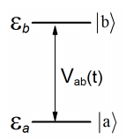

# Transition in a two-level system driven by a time-dependent potential

Consider a quantum system consisting of two energy levels $\Large|a\rangle$ and $\Large|b\rangle$ with energy gap $\Large\hbar \omega_{ba} = E_b - E_a$. Initially, these energy levels correspond to eigenstates of an unperturbed Hamiltonian $\Large\hat{H_0}$. These states are coupled upon the inclusion of a time dependent perturbation, $\Large\hat{V}(t)$, with a coupling strength $\Large V_{ab}(t) = \langle a | \hat{V}(t) | b \rangle$



The wave function for this system can be written, generically as
$$\Large | \psi \rangle = a |a \rangle + b |b\rangle$$

for which equations of motion can be derived (as shown in the [appendix A](a_eom.md))
$$\Large \dot{a} = -\frac{i}{\hbar} b e^{-i\omega_{ba}t} V_{ab}(t)$$
$$\Large \dot{b} = -\frac{i}{\hbar} a e^{i\omega_{ba}t} V_{ab}(t)$$

where we have assumed $V_{ab} = (V_{ba})^*$. If we take our time dependent perturbation to be $V_{ab}(t) = V_{ab}\cos(\omega t)$ these equations become

$$\Large \dot{a} = -\frac{i}{\hbar} b e^{-i\omega_{ba}t} V_{ab}\cos(\omega t) \qquad \normalsize \text{(1a)}$$

$$\Large \dot{b} = -\frac{i}{\hbar} a e^{i\omega_{ba}t} V_{ab}\cos(\omega t) \qquad \normalsize \text{(1b)}$$

Using the complex exponential form of the cosine function, this can also be written as

$$\Large \dot{a} = -\frac{i}{2\hbar} b  V_{ab} (e^{-i(\omega_{ba}-\omega)t} + e^{-i(\omega_{ba}+\omega)t})  \normalsize \qquad (2a) $$

$$\Large \dot{b} = -\frac{i}{2\hbar} a V_{ab} (e^{i(\omega_{ba}-\omega)t} + e^{i(\omega_{ba}+\omega)t}) \normalsize \qquad (2b) $$

From this point, analytical expressions for $a$ and $b$ may be obtained invoking the rotating wave approximation (RWA), see [appendix B](b_rwa_analytical.md).

Under this approximation, the probability of finding the molecule in the state $|b\rangle$ is
$$\Large P(b) = |b|^2 = \frac{|V_{ab}|^2}{|V_{ab}|^2 + \hbar^2(\omega_{ba} - \omega)^2} \sin^2(\Omega_R t)$$

where the Rabi frequency $(\large \Omega_R)$ is
$$\Large \Omega_R = \frac{1}{2\hbar}\sqrt{|V_{ab}|^2 + \hbar^2(\omega_{ba} - \omega)^2}$$


# Task 1: Plot Rabi Oscillations

> **Goal**: Study how the probability of finding the system in the energy level $|b\rangle$ as a function of time.

1. Create a function, `get_Pb`, that takes in a value of $\omega$, $\omega_{ba}$, and $V_{ab}$ and return and array with time and $P(b)$ values. By default you can use time values from 0 to 8000 (atomic units) with time steps of 1. For example

```julia
function get_Pb(ω, ωba, Vab; t_final = 8000, δt = 1)

    # Compute tvals and pvals

    return tvals, pvals
end
```

2. Create a second function, `solutionA`, that takes an array of $\omega$ values along with $\omega_{ba}$ and $V_{ab}$ and plots the time evolution of the probability $P(b)$ for different $\omega$ frequency values. Have all the plots in a single figure. A template of the function call is
```julia
function solutionA(ω_vals, ωba, Vab; t_final = 8000, δt = 1)
    # Compute P(b) for each value in `ω_vals` using get_Pb
    # Plot results!
end
```
3. Produce and save a figure with the following parameters:
- $\omega$ values: $14400$, $14600$, $14800$, and $15000$ cm ${}^{-1}$.
- $\omega_{ba} = 15000$ cm $^{-1}$.
- $V_{ab} = 200$ cm $^{-1}$.

# Task 2: Plot the probability peak as a function of $\omega$

> **Goal**: Study how the maximum probability of finding the system in the energy level $|b\rangle$ depends on the frequency of the oscillating perturbation.

1. Create another function, `solutionB`, that takes in a range of $\omega$ values, a $\omega_{ba}$ value and an array of $V_{ab}$ values. For each value of $V_{ab}$ you must

2. Compute the probability profile $P(b)$  across the range of $\omega$ values. (Note that this implies a double loop!).
3. Determine the maximum probability of finding the state in the energy level $|b\rangle$ $(P_\text{max})$ for each value of $\omega$.
4. Plot $P_\text{max}$ against $\omega$.

A template for this function is shown below

```julia
function solutionB(ωmin, ωmax, ωba, Vab_vals; t_final = 8000, δt = 1)

    # Use 100 steps between maximum and mininum values
    δω = (ωmax - ωmin) / 100

    ωvals = [ωmin + i*δω for i = 1:100]

    # Compute Pmax for each Vab value
    for Vab in Vab_vals

        Pvals = zeros(100)

        for i = 1:100

            # Compute Pmax for each ωvalue

        end
        ...
        # Plot Pmax versus ω for a specific value of Vab
    end

    # Display the final figure
end
```
Using this function prepare and save a figure with the following parameters:

- $\omega$ range: from 14000 to 16000, 100 steps. 
- $\omega_{ba} = 15000$ cm $^{-1}$.
- $V_{ab}$ values: $50$, $100$, $200$, and $300$ cm $^{-1}$.

# Task 3: Comparing numerical integration to the RWA result

> **Goal**: Assess the accuracy of the rotating wave approximation by numerically integrating the equation of motion for $P(b)$ for a range of $\omega_{ba}$ and $V_{ab}$ parameters.

1. Create a function, `numerical_Pb`, that integrates equation 1.

2. Use $a = 1$ and $b = 0$ as starting values. Run the simulation from $t = 0$ to $t = 8000$ with time step $\delta t = 1$.

3. For each time step, compute the gradients from equation 1.

4. Update the population of $a$ and $b$ as
$$\Large a_{n} = a_{n-1} + \frac{\partial a}{\partial t} \delta t $$
$$\Large b_{n} = b_{n-1} + \frac{\partial b}{\partial t} \delta t $$

5. Plot your results along with the analytical solution using the following parameters:

| $\omega = \omega_{ba}$ | $V_{ab}$ |
|:---:|:---:|
| 1000 | 900 |
| 1000 | 600 |
| 1000 | 300 |
| 2000 | 900 |
| 2000 | 600 |
| 2000 | 300 |
| 3000 | 900 |
| 3000 | 600 |
| 3000 | 300 |


