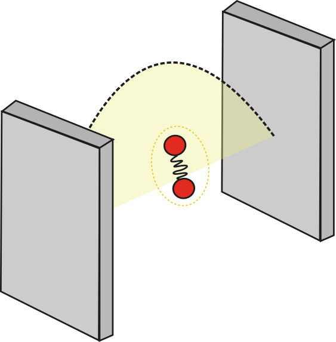

# Strong light-matter interactions

## Table of Contents

1. [Motivation](#motivation)
2. [Quantum formalism for matter](#quantum-formalism-for-matter)
3. [Quantum formalism for light](#quantum-formalism-for-light)
4. [Light-matter interaction](#light-matter-interaction)
5. [Tavis-Cummings model](#tavis-cummings-model)
6. [Task 1](#task-1)
7. [Task 2](#task-2)

## Motivation

Consider a system where the interaction between light and matter becomes significantly strong. One way to achieve this is by confining the electromagnetic field in a small space. As we will see in following sections, this can be understood recognizing the dependence of the coupling constant (relating a molecule and the quantized radiation) on the quantization volume. Experimentally, this condition has been achieved within microcavities, where light is trapped between two high-quality mirror enhancing its interaction with molecules inside it. Moreover, due to boundary conditions, the length of the cavity (distance between the two mirrors) dictates which radiation modes can be supported inside it.

<p align="center">

</p>

In this tutorial, we will build an idealized Hamiltonian that can be used to model the energetics and dynamics of systems where the coupling of light and matter becomes strong. 

## Quantum formalism for matter

At this point, we are used to quantum states of matter. For example, if we have a two-level system representing our molecule (or atom) $|g \rangle$ and $|e \rangle$, the time-independent Schrödinger gives us the energy of each state

$$\Large \hat{H}_M |g\rangle = E_g |g \rangle = \hbar \omega_g |g \rangle \normalsize \qquad \text{(1a)}$$

$$\Large \hat{H}_M |e\rangle = E_e |e \rangle = \hbar \omega_e |e \rangle \normalsize \qquad \text{(1b)}$$ 

Given that we know the eigenstates of our molecular system and we are assuming it forms a complete basis (i.e. any arbitrary molecular state can be written as a combination of $|g\rangle$ and $|e\rangle$) we can construct our Hamiltonian in this basis. Recall that the identity operator can be expressed as the resolution of the identity

$$\Large \mathbb{1} = \sum_k |k\rangle \langle k | $$

where $k$ are the basis that form the complete Hilbert space we are interested. In our case, the molecular basis contains only two basis. Thus,

$$\Large \hat{H}_M =  \mathbb{1} \hat{H}_M  \mathbb{1} = (|g\rangle \langle g | + |e\rangle \langle e | ) \hat{H}_M  (|g\rangle \langle g | + |e\rangle \langle e | ) $$

Using equation 1 and the fact the $|g\rangle$ and $|e\rangle$ are orthonormal to each other, we get

$$\Large \hat{H}_M = \hbar \omega_g |g\rangle \langle g |+ \hbar\omega_e |e\rangle \langle e | $$

For our purposes, only the energy difference between the states is important, thus we can choose the set the energy of the ground state to zero yielding the very simple matter Hamiltonian:

$$\Large \hat{H}_M = \hbar\omega_M |e\rangle \langle e | $$

where we switched the subscript to $M$ to indicate that this corresponds to the excitation energy of the system. Note that, this form of the Hamiltonian bypass the need of defining complicated molecular details, but it requires the *a priori* knowledge of the energy levels of the system. 

We can also define ladder operators in this basis

$$\Large \hat{\sigma}^+ = |e\rangle \langle g |$$

$$\Large \hat{\sigma}^- = |g\rangle \langle e |$$
such that

$$\Large \hat{\sigma}^+ |g \rangle = |e\rangle \qquad \hat{\sigma}^+ |e \rangle = 0$$

$$\Large \hat{\sigma}^- |g \rangle = 0 \qquad \hat{\sigma}^- |e \rangle = |g \rangle$$
Therefore, an alternative Hamiltonian could also be written as 
$$\Large \hat{H}_M = \hbar\omega_M \hat{\sigma}^+ \hat{\sigma}^- $$

For a system of $N$ non-interacting molecules, this formalism extends itself easily since the total Hamiltonian is just a sum of individual molecule operators

$$\Large \hat{H}_M = \sum_i \hbar \omega_i \hat{\sigma}^+_i \hat{\sigma}^-_i $$

## Quantum formalism for light

Upon quantization, the Hamiltonian for electromagnetic field resembles that of a harmonic oscillator

$$\Large \hat{H}_L = \sum_k \hbar \omega_k\hat{a}_k^\dagger\hat{a}_k$$

where the divergent zero-point energy component has been conveniently removed as it does not play a role in the problem we are interested. The operators $a_k$ and $a^\dagger$ are annihilation and creation operators for Bosons, respectively. The eigenstates of the Hamiltonian above are the Fock (or number) states represented generically as

$$\Large |n_1 n_2 n_3 ... n_k \rangle $$

where each $n_i$ represents the number of photons in the $i$-th radiation mode. The action of the second quantized operators onto this state is

$$\Large \hat{a}_i |n_1 n_2\ ...\  n_i \ ...\  n_k \rangle = \sqrt{n_k} |n_1 n_2 \ ...\  (n_i-1) \ ...\  n_k \rangle $$

$$\Large \hat{a}_i^\dagger |n_1 n_2\ ...\  n_i \ ...\  n_k \rangle = \sqrt{n_k+1} |n_1 n_2 \ ...\  (n_i+1) \ ...\  n_k \rangle $$

Note that, the annihilation operator will destroy the system (return zero) if no photons occupy the mode being operated. However, unlike the case for Fermions, the creation operator will not destroy the system regardless of the population of the mode.

> Nonetheless, the creation operation may still destroy the state when operating on the left, in which case it is really acting as an annihilation operator.

The number operator $\hat{N} =\hat{a}_i^\dagger\hat{a}_i$ is an useful shortcut that probes the population of a given mode

$$\Large \hat{N}_i|n_1 n_2\ ...\  n_i \ ...\  n_k \rangle=\hat{a}_i^\dagger\hat{a}_i |n_1 n_2\ ...\  n_i \ ...\  n_k \rangle$$

$$= \Large\hat{a}_i^\dagger \sqrt{n_i} |n_1 n_2\ ...\  (n_i-1) \ ...\  n_k \rangle$$

$$= \Large \sqrt{n_i-1+1}\sqrt{n_i} |n_1 n_2\ ...\  (n_i-1+1) \ ...\  n_k \rangle$$

$$= \Large n_i |n_1 n_2\ ...\  n_i \ ...\  n_k \rangle$$

This operator makes the interpretation of the radiation Hamiltonian straightforward: each mode $k$ contributes to the total energy as $n\hbar \omega_k$, where $n$ is the number of photons in that mode.

## Light-Matter Interaction

In the semi-classical theory, we have used the dipole approximation to write the interaction between light as

$$\Large \hat{H}_{LM}= -\hat{\mu}\cdot \mathbf{E}$$

where $\hat{\mu}$ is the dipole moment operator and $\mathbf{E}$ is the electric field. In the fully quantum description, the electric field must be replaced with an operator

$$\Large \hat{H}_{LM}= -\hat{\mu}\cdot \hat{E} \qquad \normalsize (2)$$

which, in the basis of plane waves, can be written as

$$\Large \hat{E} = -i\sum_k \vec{\varepsilon}_k \sqrt{\frac{\hbar\omega_k}{2\epsilon_0 V}}\[e^{i\mathbf{k}\cdot\mathbf{r}}\hat{a}_k - e^{-i\mathbf{k}\cdot\mathbf{r}}\hat{a}_k^\dagger \] \qquad \normalsize (3)$$

The dipole moment can be resolved using our two-level basis, we will further assume that the dipole moment of the ground and excited states is zero, that is $\langle g| \hat{\mu} |g \rangle = \langle e| \hat{\mu} |e \rangle = 0$. Thus, the dipole operator can be written as

$$\Large \hat{\mu} = \vec{\mu}\_{eg} | e \rangle \langle g | + \vec{\mu}_{ge} |g\rangle \langle e|$$

Using the Hermitian property of the dipole $(\mu_{eg}=\mu_{ge})$ and introducing the molecular ladder operator we get

$$\Large \hat{\mu} = \vec{\mu}_{M} (\hat{\sigma}^+ + \hat{\sigma}^-) \qquad \normalsize (4)$$

Putting (3) and (4) back into (2) gives us

$$\Large \hat{H}\_{LM} = -i\sum_k \vec{\mu}_{M} \cdot \vec{\varepsilon}_k \sqrt{\frac{\hbar\omega_k}{2\epsilon_0 V}}\[e^{i\mathbf{k}\cdot\mathbf{r}}\hat{a}_k - e^{-i\mathbf{k}\cdot\mathbf{r}}\hat{a}_k^\dagger \] (\hat{\sigma}^+ + \hat{\sigma}^-)$$

Defining the light-matter coupling constant

$$\Large g_{kM} = \vec{\mu}_{M} \cdot \vec{\varepsilon}_k \sqrt{\frac{\hbar\omega_k}{2\epsilon_0 V}} $$
we write the light-matter Hamiltonian as

$$\Large \hat{H}\_{LM} = -i\sum_k g_{kM}[e^{i\mathbf{k}\cdot\mathbf{r}}\hat{a}_k - e^{-i\mathbf{k}\cdot\mathbf{r}}\hat{a}_k^\dagger ] (\hat{\sigma}^+ + \hat{\sigma}^-)$$

In many circumstances, neglecting the dependence on the wave vector $\mathbf{k}$ is a suitable approximation. This is the case when the wavelength of the field is much greater than the dimensions of the molecule. Neglecting the exponential terms,the molecule experience a constant electromagnetic field. Under this simplification, the Hamiltonian becomes

$$\Large \hat{H}\_{LM} = -i\sum_k g_{kM}(\hat{a}_k - \hat{a}_k^\dagger ) (\hat{\sigma}^+ + \hat{\sigma}^-)$$

Multiplying out the operators yields

$$\Large \hat{H}\_{LM} = -i\sum_k g_{kM}(\hat{a}_k\hat{\sigma}^+   - \hat{a}_k^\dagger\hat{\sigma}^- + \hat{a}_k\hat{\sigma}^-   - \hat{a}_k^\dagger\hat{\sigma}^+) $$

In the first term, a photon is annihilated as a molecule is excited. Thus, it can be linked to the absorption process. Similarly, the second term can represent emission where the deexcitation of a molecule is followed by the creation of a photon. However, the last two terms lack a simple interpretation, as they are pairs of raising or lowering operators. Another traditional approximation is to neglect those terms, as they are not "energy conserving". This argument is slightly misleading since energy must be conserved even if those terms are included. As it turns out, neglecting these terms is equivalent to the Rotating Wave Approximation (RWA) discussed in the [previous project](../2_RabiOscillations/b_rwa_analytical.md). To understand this, let us compute a matrix element arising from $\hat{a}_k\hat{\sigma}^+$ and compare to $\hat{a}_k^\dagger\hat{\sigma}^+$

$$\Large \langle\psi_1|\hat{a}_k\hat{\sigma}^+|n,g\rangle\qquad 
\langle\psi_2|\hat{a}_k^\dagger\hat{\sigma}^+|n,g\rangle $$

where $|n,g\rangle$ represents a state with $n$ photons in a mode $k$ and a molecule in its ground state. In the Schrödinger picture, this includes a time-dependent phase that here we must write explicitly

$$\Large |n,g\rangle \rightarrow e^{in\omega_k t} |n,g\rangle$$

$$\Large |n,e\rangle \rightarrow e^{i(n\omega_k + \omega_{M})t} |n,e\rangle$$

where we assume the energy of the molecular ground state is zero and the energy of the excited states is $\hbar \omega_{M}$. In order to yield a non-zero matrix element, we must have

$$\Large \langle\psi_1| =  \langle e, n-1| \rightarrow \langle e, n-1|e^{-i((n-1)\omega_k + \omega_{M})t}$$

$$\Large \langle\psi_2| =  \langle e, n+1| \rightarrow \langle e, n+1|e^{-i((n+1)\omega_k + \omega_{M})t}$$

Putting all pieces together we get

$$\Large \langle n-1,e|\hat{a}_k\hat{\sigma}^+|n,g\rangle = e^{-i[(n-1)\omega_k+\omega_M]t} e^{in\omega_k t} = e^{-i[\omega_M-\omega_k]t}$$ 

$$\Large \langle n+1,e|\hat{a}_k^\dagger\hat{\sigma}^+|n,g\rangle = e^{-i[(n+1)\omega_k+\omega_M]t} e^{in\omega_k t} = e^{-i[\omega_M+\omega_k]t}$$

Here, the argument used in the RWA becomes clearer: matrix elements of two-raising operators oscillate at high frequency and are expected to be averaged out. Once this approximation is implemented, our final Hamiltonian for light-matter interaction becomes

$$\Large \hat{H}\_{LM} = -i\sum_k g_{kM}(\hat{a}_k\hat{\sigma}^+   - \hat{a}_k^\dagger\hat{\sigma}^- )$$

or for an arbitrary number of molecules

$$\Large \hat{H}\_{LM} = -i\sum_k \sum_j g_{kj}(\hat{a}_k\hat{\sigma}_j^+   - \hat{a}_k^\dagger\hat{\sigma}_j^- )$$

## Tavis-Cummings Model

The Tavis-Cummings model is an idealized method where $N$ molecules interact with a single radiation mode, labeled as $c$, under the following assumptions

- The molecules do not interact among themselves.
- The interaction between the radiation and the molecules follows the Hamiltonian described in the previous section. 
- All molecules have the same coupling strength with the radiation mode $(g)$.
- All molecules are described by a two-level system with uniform excitation energy $(\hbar \omega_M)$.

The total Hamiltonian is then

$$\Large \hat{H} = \sum_j \hbar \omega_M \hat{\sigma}^+_j \hat{\sigma}^-_j + \hbar \omega_c \hat{a}^\dagger\hat{a} - i \sum_j g (\hat{a}\hat{\sigma}_j^+   - \hat{a}^\dagger\hat{\sigma}_j^- )$$

From this point, we can obtain the energy eigenstates of the system following the traditional recipe from matrix mechanics: construct the Hamiltonian matrix using some basis followed by a diagonalization procedure. The choice of basis should not be arbitrary, one must use the adequate basis for the particular problem to be solved and considering structure of the Hamiltonian. For example, consider the somewhat naive basis set:

$$\Large \{|n,m\rangle\} = |0,0\rangle \  |1,0\rangle \  |0,a\rangle \  |0,b\rangle \  |2,0\rangle \  |1,a\rangle \  |1,b\rangle$$

where $n$ represent the number of photons and $m$ indicates which molecule is excited (in this example, $a$ or $b$, with zero representing no molecular excitations). The Hamiltonian built from this basis takes the following structure

$$
\mathbf{H} =
\left[
\begin{array}{c | c c c c c c c}
\hat{H} & |0,0\rangle & |1,0\rangle & |0,a\rangle & |0,b\rangle & |2,0\rangle & |1,b\rangle & |1,b\rangle \\
\hline
\langle 0,0| & 0 & 0 & 0 & 0 & 0 & 0 & 0 \\ 
\langle 0,1| & 0 & \hbar\omega_c & ig & ig & 0 & 0 & 0 \\ 
\langle a,0| & 0 & -ig & \hbar\omega_M & 0 & 0 & 0 & 0 \\ 
\langle b,0| & 0 & -ig & 0 & \hbar\omega_M & 0 & 0 & 0 \\ 
\langle 0,2| & 0 & 0 & 0 & 0 & 2\hbar\omega_c & i\sqrt{2}g & i\sqrt{2}g \\ 
\langle a,1| & 0 & 0 & 0 & 0 & -i\sqrt{2}g & \hbar(\omega_M+\omega_c) & 0 \\ 
\langle b,1| & 0 & 0 & 0 & 0 & -i\sqrt{2}g & 0 & \hbar(\omega_M+\omega_c) \\ 
\end{array}
\right]
$$

Note that this Hamiltonian has a block diagonal structure, with each block being associated with a specific number of photons:

$$\Large \mathbf{H} = \mathbf{H}\_{n=0} \oplus \mathbf{H}\_{n=1} \oplus \mathbf{H}\_{n=2}$$

In practice, this means we only need to consider basis states with the relevant number of photons we want to study. In our case, we will concentrate on the case where there is only one photon up for absorption. Thus

$$\Large \{|n,m\rangle\} = \ |1,0\rangle \ |0,a\rangle \ |0,b\rangle \ |0,c\rangle \ |0,d\rangle \ ... $$ 

Therefore, a system with $N$ molecules results in a $(N+1)\times (N+1)$ Hamiltonian matrix. As a convention, we shall use our first basis element as the one where the photon is free and no molecule is excited. Our single photon Hamiltonian matrix is

$$\mathbf{H} = 
\left[
\begin{array}{c c c c c c }
\hbar\omega_c & ig & ig & ig &\dots & ig \\
-ig & \hbar \omega_M & 0 & 0 &\dots & 0 \\
-ig & 0 & \hbar\omega_M & 0 &\dots & 0 \\
-ig & 0 & 0 & \hbar\omega_M &\dots & 0 \\
\vdots & \vdots & \vdots &\vdots & \ddots & 0 \\
-ig & 0 & 0 & 0 & 0 &\hbar\omega_M 
\end{array}
\right]
$$

At this point, one can diagonalize this matrix to obtain the energy levels of the system. However, the highly regular structure of the Hamiltonian matrix allows for a change of basis that simplifies the problem further. If we define a bright state as the symmetric combination of all molecular excitations

$$\Large |B\rangle = \frac{1}{\sqrt{N}}(|0,a\rangle + |0,b\rangle + |0,c\rangle + |0,d\rangle + ... )$$

we can also find $N-1$ dark states $(|D_\mu\rangle)$ forming a new symmetry-adapted basis. In this basis, the Hamiltonian matrix becomes

$$\mathbf{H} = 
\left[
\begin{array}{c c c c c c }
\hbar\omega_c & i\sqrt{N}g & 0 & 0 &\dots & 0 \\
-i\sqrt{N}g & \hbar \omega_M & 0 & 0 &\dots & 0 \\
0 & 0 & \hbar\omega_M & 0 &\dots & 0 \\
0 & 0 & 0 & \hbar\omega_M &\dots & 0 \\
\vdots & \vdots & \vdots &\vdots & \ddots & 0 \\
0 & 0 & 0 & 0 & 0 &\hbar\omega_M 
\end{array}
\right]
$$

with this new basis, only the bright state couples with light. Therefore, our problem becomes a simple $2\times2$ diagonalization for which solutions are analytical. The two energy levels arising from this interaction are labeled upper polariton $|\text{UP}\rangle$ and lower polariton $|\text{LP}\rangle$ for which energies are

$$\Large E_\text{LP} = \frac{\hbar \omega_c + \hbar \omega_M}{2} - \frac{1}{2}\sqrt{\Omega_R^2 + (\omega_c - \omega_M)^2} \qquad \normalsize (5a)$$

$$\Large E_\text{UP} = \frac{\hbar \omega_c + \hbar \omega_M}{2} + \frac{1}{2}\sqrt{\Omega_R^2 + (\omega_c - \omega_M)^2} \qquad \normalsize (5b)$$

where the Rabi splitting $(\Omega_R)$ is defined as

$$\Large \Omega_R = 2\sqrt{N}g$$


## Task 1

> Goal: Explicitly build the Hamiltonian matrix and compare its eigenvalues with the analytical result from the Tavis-Cumming model

Write a function to construct a Hamiltonian matrix for an arbitrary number of molecules and cavity frequency. For example:

```julia
function build_H(N, ωc)

    # Return (N+1)x(N+1) Hamiltonian matrix

end
```

You can use the following parameters as default:

- $\omega_M = 1000$ $\text{cm}^{-1}$
- $g = 2$ $\text{cm}^{-1}$

Next, prepare a plot of the energy splitting as a function of the number of molecules $N$. For every value of $N$ you will need to

1. Build your Hamiltonian using the function you created earlier.
2. Diagonalize the matrix to get your eigenvalues.
3. Analyze your eigenvalues to figure out what is the energy splitting due to light-matter coupling.

You should go up to at lest $N=1000$. To reduce the cost, you can use steps of 20 or 50 for $N$ to produce a scatter plot. Also plot, in the same picture, the expected splitting from the analytical results (equation 5).

## Task 2

> Goal: study how the energy of the polaritons change with detuning and compare it to the non-interacting limit.

In this task, you will use a fixed number of molecules $(N = 100)$ and compute the polariton energies as a function of the detuning, defined as

$$\Large \delta = \omega_M - \omega_c$$

Take values of $\delta$ in the range of -100 to 100 $\text{cm}^{-1}$ and plot the upper and lower polariton energies. Moreover, for reference, plot the non-interacting limit as two straight lines representing the energy of a single molecule and a single photon. For contrast, use difference styles for the polariton curves and the non-interacting lines. 
